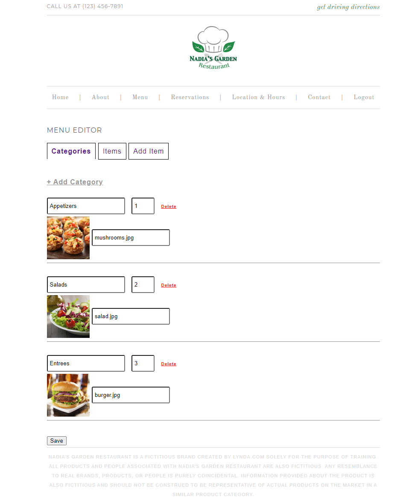

# Nadias Garden Restaurant

This application depicts the functionality of a factitious Restuarant website to manage **categories** and **menu**

## Set Up

1. Run `git clone https://github.com/aliahmadcse/nadias.git`
2. Run `cp .evn.example .env`
3. Create a database name **nadias**
4. Populate your server and database info in .env file
5. Run `composer install && npm install && npm run dev`
6. Run `php artisan key:generate`
7. Run `php artisan migrate`
8. Run `php artisan serve`
9. 👌 Your application is located at `localhost:8000`
